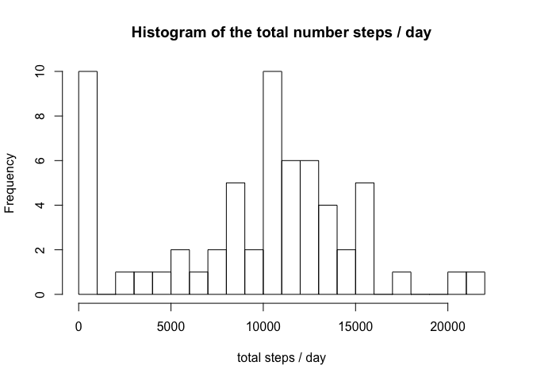
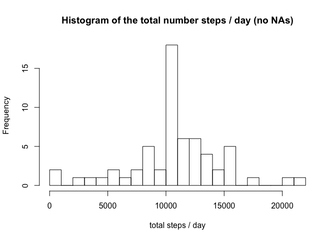
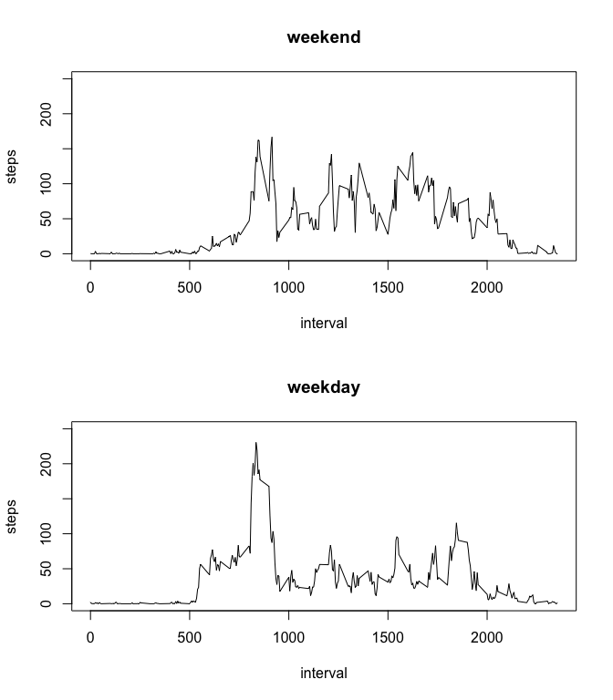

# Reproducible Research: Peer Assessment 1


## Loading and preprocessing the data

Reads the data while uncompressing it.

The date will be transformed to a POSIXct format.


```r
data <- read.csv(unz('activity.zip', 'activity.csv'))

data$date <- as.POSIXct(data$date, format = "%Y-%m-%d", tz = "UTC")
```

## What is mean total number of steps taken per day?


```r
steps.total <- aggregate(data['steps'], data['date'], FUN = "sum", na.rm = TRUE)

with(steps.total, {
    hist(steps, breaks=20, main = "Histogram of the total number steps / day", 
         xlab = "total steps / day")
})
```

 

The mean and the median of the steps:


```r
library(xtable)

steps.mean = mean(steps.total$steps, na.rm = TRUE)
steps.median = median(steps.total$steps, na.rm = TRUE)

summary <- data.frame(mean = steps.mean, median = steps.median, 
                      row.names = "steps")

print(xtable(summary), "html")
```

<!-- html table generated in R 3.2.2 by xtable 1.7-4 package -->
<!-- Sat Sep 19 19:54:14 2015 -->
<table border=1>
<tr> <th>  </th> <th> mean </th> <th> median </th>  </tr>
  <tr> <td align="right"> steps </td> <td align="right"> 9354.23 </td> <td align="right"> 10395 </td> </tr>
   </table>

## What is the average daily activity pattern?


```r
steps.average = aggregate(data['steps'], data['interval'], FUN = "mean", 
                          na.rm = TRUE)

with(steps.average, {
    plot(interval, steps, type = "l")
})
```

 

Interval with max steps:


```r
library(xtable)

print(xtable(steps.average[which.max(steps.average$steps),]), "html", 
      include.rownames = FALSE)
```

<!-- html table generated in R 3.2.2 by xtable 1.7-4 package -->
<!-- Sat Sep 19 19:54:14 2015 -->
<table border=1>
<tr> <th> interval </th> <th> steps </th>  </tr>
  <tr> <td align="right"> 835 </td> <td align="right"> 206.17 </td> </tr>
   </table>

## Imputing missing values

Total number of missing values:


```r
steps.nas = sum(is.na(data$steps))

print(steps.nas)
```

```
## [1] 2304
```

Histogram of total number of steps, NAs replaced with the mean for the interval
in all days:


```r
require(plyr)
```

```
## Loading required package: plyr
```

```r
require(Hmisc)
```

```
## Loading required package: Hmisc
## Loading required package: grid
## Loading required package: lattice
## Loading required package: survival
## Loading required package: Formula
## Loading required package: ggplot2
## 
## Attaching package: 'Hmisc'
## 
## The following objects are masked from 'package:plyr':
## 
##     is.discrete, summarize
## 
## The following objects are masked from 'package:xtable':
## 
##     label, label<-
## 
## The following objects are masked from 'package:base':
## 
##     format.pval, round.POSIXt, trunc.POSIXt, units
```

```r
data.full <- ddply(data, "interval", mutate, steps = impute(steps, mean))
```


```r
steps.full.total <- aggregate(data.full['steps'], data.full['date'], FUN = "sum")

with(steps.full.total, {
    hist(steps, breaks=20, 
         main = "Histogram of the total number steps / day (no NAs)", 
         xlab = "total steps / day")
})
```

 


```r
library(xtable)

steps.full.mean = mean(steps.full.total$steps)
steps.full.median = median(steps.full.total$steps)

summary <- data.frame(mean = steps.full.mean, median = steps.full.median, 
                      row.names = "steps")

print(xtable(summary), "html")
```

<!-- html table generated in R 3.2.2 by xtable 1.7-4 package -->
<!-- Sat Sep 19 19:54:17 2015 -->
<table border=1>
<tr> <th>  </th> <th> mean </th> <th> median </th>  </tr>
  <tr> <td align="right"> steps </td> <td align="right"> 10766.19 </td> <td align="right"> 10766.19 </td> </tr>
   </table>

Comparing with the plot that has the NAs, imputing the average steps for the
interval lowered the frequency of 0 steps and increased the frequency of the
others interval, biasing the mean towards the right. The median also followed
this biasing.

Interesting that the mean and the median has the same values now, as there are
less "zero" values.

## Are there differences in activity patterns between weekdays and weekends?


```r
weekday <- weekdays(data.full$date, abbreviate = TRUE)
data.full$day <- factor(weekday %in% c('Sat', 'Sun'), levels = c(FALSE, TRUE),
                         labels = c('weekday', 'weekend'))

avg.by_weekday <- aggregate(data.full['steps'], 
                            c(data.full['day'], data.full['interval']), 
                            FUN = "mean")

max.weekday <- max(avg.by_weekday$steps[avg.by_weekday$day == "weekday"])
max.weekend <- max(avg.by_weekday$steps[avg.by_weekday$day == "weekend"])

# Some calculus to make it multiple of 50
max.steps <- ceiling(max(max.weekend, max.weekday)/50) * 50

par(mfrow=c(2,1))

with(subset(avg.by_weekday, day == "weekend"), {
    plot(interval, steps, type="l", ylim=c(0, max.steps), main = "weekend")
})

with(subset(avg.by_weekday, day == "weekday"), {
    plot(interval, steps, type="l", ylim=c(0, max.steps), main = "weekday")
})
```

 

